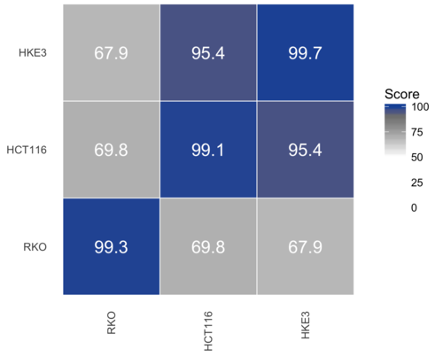
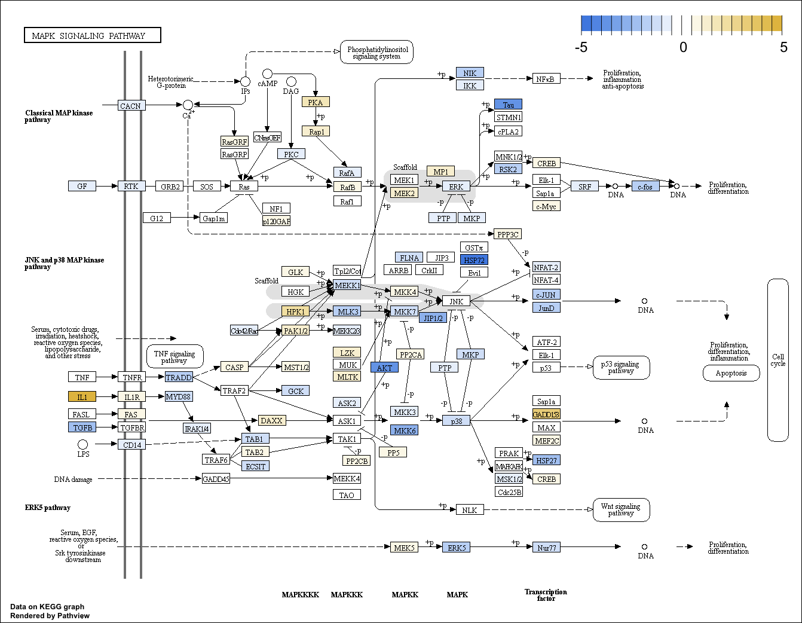
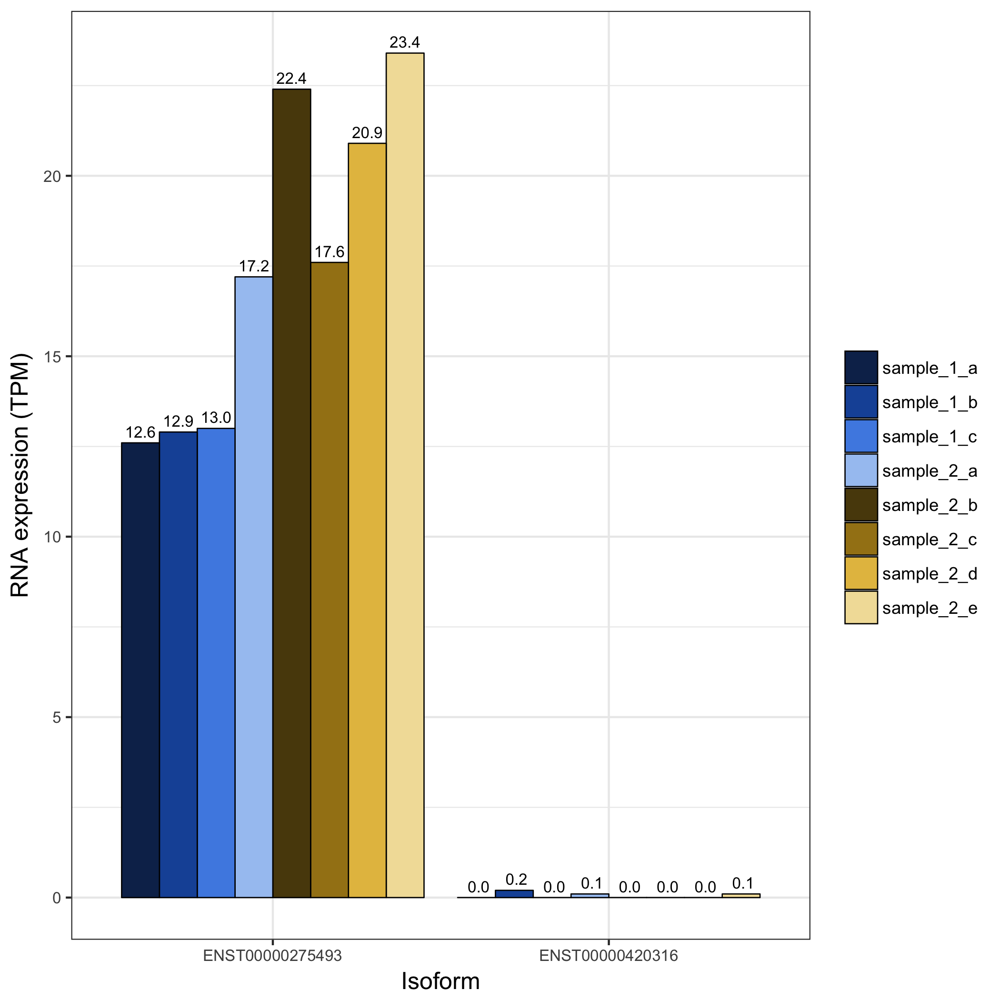
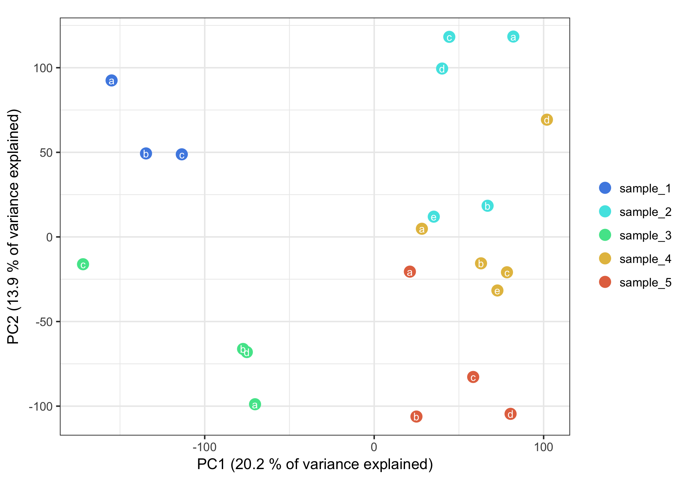
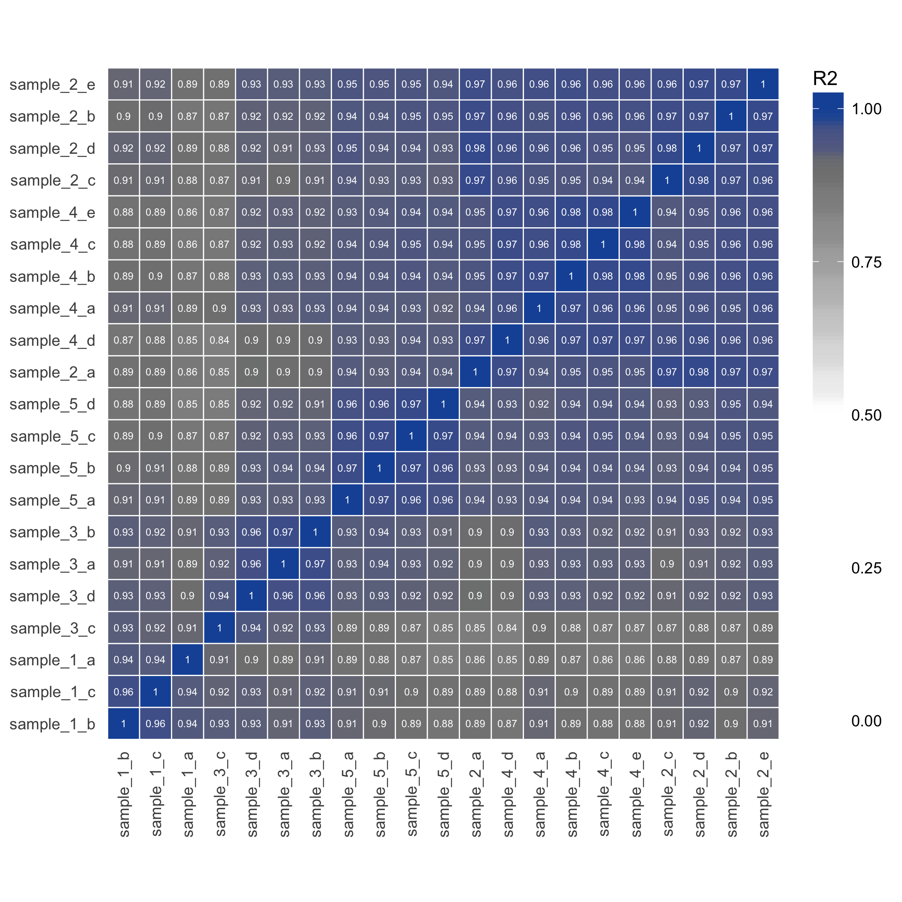
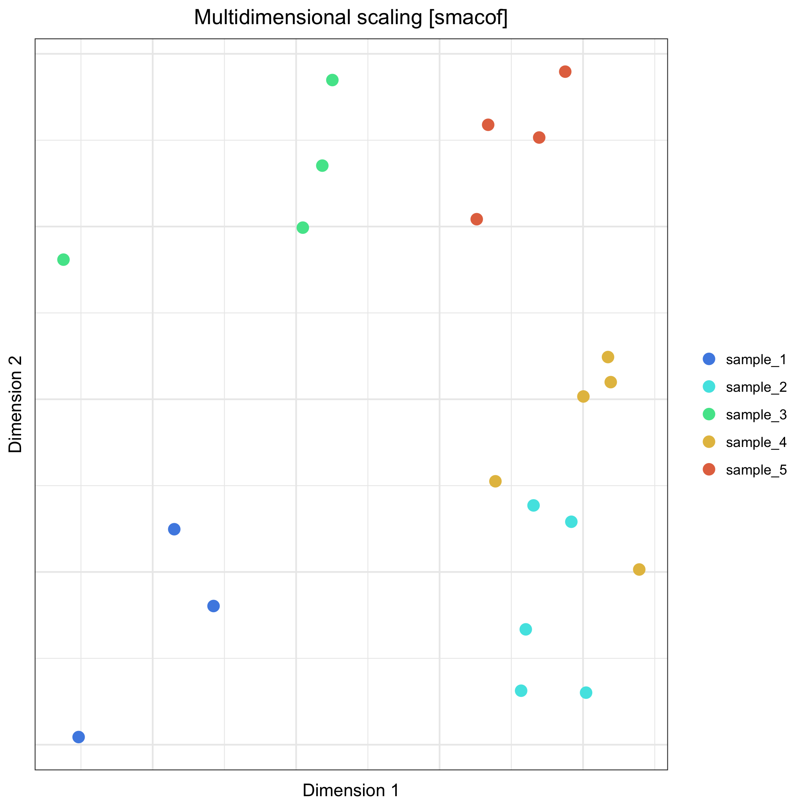
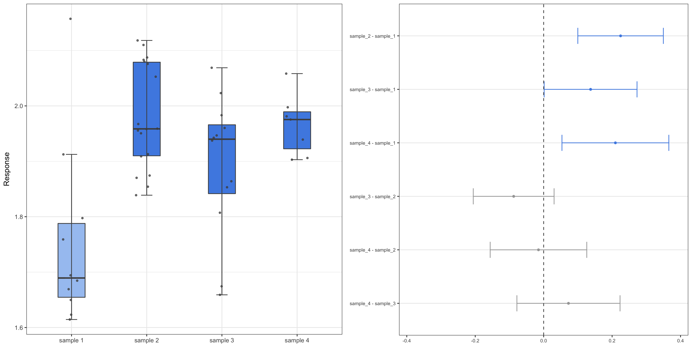

# Miscellaneous Bioinformatic Tools
[![License: MIT][badge]][licence]

This is a collection of miscellaneous bioinformatic tools and scripts that I
have created and used during my PhD studies. They are written in R, Python and
bash (but mostly R) and are meant to be called from the command line. They are
sorted according to their general theme and use. You can get help by calling
any script from the command line with the `-h` (or `--help`) flag. The topics
covered by mBIT are as follows:

* Variant analysis using [seqCAT][seqcat]
* Fetching gene/transcript information from biomaRt
* Gene/transcript expression analyses, including differential expression
* Unsupervised learning and clustering analyses
* Enrichment analysis, ANOVA and a wrapper for eSNP-Karyotyping

## Variant analysis with *seqCAT*

These are scripts using the [seqCAT][seqcat] Bioconductor R-package for variant
analysis of high throughput sequencing (HTS) data. They are simple wrappers for
a common workflow for seqCAT, to facilitate re-use and aggregate analysis of
many samples at once.

```{bash Variant analysis}
# Create SNV profiles from VCFs in a directory
create_profiles.R <input VCF directory> <output profile directory>

# Compare genetic similarities for all created profiles
compare_profiles.R <input profile directory> similarities.txt

# Create a similarity heatmap from comparisons
similarity_heatmap.R similarities.txt similarities.png --cluster
```

<p align="center">
    
</p>

## Get gene and transcript information from biomaRt

This is a simple script for fetching information regarding gene and transcript
IDs, symbols and biotypes from Ensembl using the [biomaRt][biomart] package.
These information files are used in some of the other scripts for filtering
out non-coding genes or mapping transcripts to genes.

```{bash Get biomaRt info}
# Get biomaRt information
get_biomart_info.R GRCh38 biomart/biomart.grch38.txt
```

## Differential expression analysis

These are scripts related to differential expression analyses (DEA) of RNA-seq
data. The main one, `de_analysis.R` calculates which genes are differentially
expressed between two samples, using either [DESeq2][deseq2], [edgeR][edger] or
[Limma][limma] or a combination of overlapping DEGs between them. It can handle
inputs as either raw counts or gene expression measurements (TPM) from both
[Kallisto][kallisto] and [Salmon][salmon], using [TXimport][tximport]. The
other scripts can analyse the output from `de_analysis.R` in various ways.

```{bash DEA}
# Calculate differential expression
# This script has many options and parameters: use `-h` to see them all
de_analysis.R counts.txt sample1,sample2 biomaRt_info.txt degs.txt edgeR

# Create a volcano plot of DEGs
volcano.R degs.txt volcano.png

# Plot the p-value distribution of DEGs
p_distribution.R degs.txt p_distribution.png
```

<p align="center">
    
    
</p>

The `pathway_analysis.R` script can analyse a DEG list and one or more
specified KEGG pathways, finding which genes are differentially expressed
in that pathway and visualises them in an image with fold change colour
gradients. It can also quantify and list the various types of interactions
(*e.g.* phosphorylations, direct interactions, etc.) in said pathway(s),
where a *perturbation event* is defined as an interaction **A --> B** where
**A** is a DEG. All this is done via the [Pathview][pathview] package.

```{bash Pathway analysis}
# Analyse the MAPK pathway
pathway_analysis.R degs.txt
```

<p align="center">
    
</p>

## Raw transcript/gene expression analyses

These are scripts for collecting and analysing raw gene and transcript
expression estimates from both [Salmon][salmon] and [Kallisto][kallisto]. The
first script, `collect_tpm.sh` is a BASH/AWK script for collecting all the
replicates in a directory structure into a single file, and the subsequent
scripts can use its output.

```{bash Expression analyses}
# Collect TPM estimates across samples into a single file
collect_tpm.sh <base Salmon/Kalliso directory> > tpm.transcripts.txt

# Sum transcript-level TPM to the gene level
expression_sums.R tpm.transcripts.txt <biomaRt info file> tpm.genes.txt

# Calculate TPM means across samples
expression_means.R tpm.transcripts.txt <s1,s2,...> tpm.transcripts.means.txt

# Plot some specific transcripts
expression_barplot.R tpm.transcripts.txt <ENSTID1,ENSTID2,...> transcripts.png
```

<p align="center">
    
</p>

## Multivariate analyses and machine learning

These are scripts related to multivariate analyses and machine learning,
applied on either variant or expression data from the above analyses. The
`pairwise_correlations.R` script performs correlations in a pairwise manner
between samples, for use in the `heatmap.R`, `dendrogram.R` and `mds.R`
scripts, while the `pc_analysis.R` performs a principal component analysis on
expression data.

```{bash Unsupervised learning}
# Perform PCA on expression data (with log2 normalisation)
pc_analysis.R tpm.genes.txt pca.png -l

# Perform pairwise correlations with expression data (with log2 normalisation)
pairwise_correlations.R tpm.genes.txt correlations.txt -l

# Add some sample-specific metadata (such as known groups) to the correlations
add_metadata.R correlations.txt <metadata file> correlations.metadata.txt

# Cluster the data and plot a heatmap of similarities
heatmap.R correlations.metadata.txt r2 heatmap.png -c all

# Cluster the data and plot a dendrogram
dendrogram.R correlations.metadata.txt r2 dendrogram.png -g <groups column>

# Cluster the data a plot a multidimensional scaling plot
mds.R correlations.metadata.txt r2 mds.png -g <groups column>
```

<p align="center">
    
    
</p>

<p align="center">
    
    
</p>

## Miscellaneous

The `enrichment_analyses.R` script analyses a list of genes and performs an
enrichment analysis on them, to see if any annotation terms are statistically
overrepresented. The gene list can be either the output from the DE analysis
above, or any list of genes with a column header of `ENSGID`. Enrichment can be
performed on either GO ([Gene Ontology][geneont]) or KEGG ([Kyoto Encyclopedia
of Genes and Genomes][kegg]) terms.

```{bash Enrichment analysis}
# Perform a GOslim enrichment analysis and plot top 10 terms
enrichment_analysis.R degs.txt biomaRt_info.txt enrichment.png -t GOslim
```

<p align="center">
    
</p>

The `anova.R` script takes long-format data containing both `treatment` and
`response` variables, and checks if there are any differences between groups
(differently coloured groups are significantly different).

```{bash ANOVA}
# Perform ANOVA and Tukey's HSD
anova.R <input> anova.png <treatment variable> <response variable>
```

<p align="center">
    
</p>

The miscellaneous group also contains the `esnp_karyotyping.R` script for
performing [eSNP-Karyotyping][esnp], which is a wrapper for the package with
the same name. It calculated the mean allelic ratios across SNV profiles
(created with the [seqCAT][seqcat] package), which can yield information on
aneuploidy and chromosomal aberrations in RNA-seq data.

```{bash eSNP-Karyotyping}
esnp_karyotyping.R <SNV profile> esnp.txt
esnp_karyotyping <SNV profile directory> esnp.txt --directory
```

# License

These scripts are available with a MIT licence. They are free software: you may
redistribute and/or modify them under the terms of the MIT license. For more
information, please see the `LICENCE` file.

[badge]: https://img.shields.io/badge/license-mit-blue.svg
[licence]: https://opensource.org/licenses/mit

[biomart]: https://bioconductor.org/packages/release/bioc/html/biomaRt.html
[deseq2]: https://bioconductor.org/packages/release/bioc/html/DESeq2.html
[edger]: http://bioconductor.org/packages/release/bioc/html/edgeR.html
[esnp]: https://github.com/BenvenLab/eSNPKaryotyping
[geneont]: http://www.geneontology.org/
[kallisto]: https://pachterlab.github.io/kallisto/
[kegg]: http://www.kegg.jp/
[limma]: http://bioconductor.org/packages/release/bioc/html/limma.html
[pathview]: https://bioconductor.org/packages/release/bioc/html/pathview.html
[salmon]: https://combine-lab.github.io/salmon/
[seqcat]: https://bioconductor.org/packages/release/bioc/html/seqCAT.html
[tximport]: https://bioconductor.org/packages/release/bioc/html/tximport.html
